# **Course Work Waze Project**

**The goal** is to use a dataframe constructed within Python, perform inspection of the data provided, and develop a machine learning model that will help prevent churn, improve user retention, and drive business growth for Waze.

# **PACE stages**
## **Plan**

### Understand the situation
##### Reading the data, exploring the dataset to identify key variables.

## **Analyze**
### **Data exploration and cleaning**

Consider the following questions:


1.  Given the scenario, which data columns are most applicable?

   The more relevant columns are user app usage, drives, and sessions.  


### Imports and data loading


```python
# Import packages
import pandas as pd
import numpy as np
import matplotlib.pyplot as plt
import seaborn as sns

# Load dataset into dataframe
df = pd.read_csv("waze_dataset.csv")
```

### Summary information


```python
df.head(10)
```


<div>
<style scoped>
    .dataframe tbody tr th:only-of-type {
        vertical-align: middle;
    }

    .dataframe tbody tr th {
        vertical-align: top;
    }

    .dataframe thead th {
        text-align: right;
    }
</style>
<table border="1" class="dataframe">
  <thead>
    <tr style="text-align: right;">
      <th></th>
      <th>ID</th>
      <th>label</th>
      <th>sessions</th>
      <th>drives</th>
      <th>total_sessions</th>
      <th>n_days_after_onboarding</th>
      <th>total_navigations_fav1</th>
      <th>total_navigations_fav2</th>
      <th>driven_km_drives</th>
      <th>duration_minutes_drives</th>
      <th>activity_days</th>
      <th>driving_days</th>
      <th>device</th>
    </tr>
  </thead>
  <tbody>
    <tr>
      <th>0</th>
      <td>0</td>
      <td>retained</td>
      <td>283</td>
      <td>226</td>
      <td>296.748273</td>
      <td>2276</td>
      <td>208</td>
      <td>0</td>
      <td>2628.845068</td>
      <td>1985.775061</td>
      <td>28</td>
      <td>19</td>
      <td>Android</td>
    </tr>
    <tr>
      <th>1</th>
      <td>1</td>
      <td>retained</td>
      <td>133</td>
      <td>107</td>
      <td>326.896596</td>
      <td>1225</td>
      <td>19</td>
      <td>64</td>
      <td>13715.920550</td>
      <td>3160.472914</td>
      <td>13</td>
      <td>11</td>
      <td>iPhone</td>
    </tr>
    <tr>
      <th>2</th>
      <td>2</td>
      <td>retained</td>
      <td>114</td>
      <td>95</td>
      <td>135.522926</td>
      <td>2651</td>
      <td>0</td>
      <td>0</td>
      <td>3059.148818</td>
      <td>1610.735904</td>
      <td>14</td>
      <td>8</td>
      <td>Android</td>
    </tr>
    <tr>
      <th>3</th>
      <td>3</td>
      <td>retained</td>
      <td>49</td>
      <td>40</td>
      <td>67.589221</td>
      <td>15</td>
      <td>322</td>
      <td>7</td>
      <td>913.591123</td>
      <td>587.196542</td>
      <td>7</td>
      <td>3</td>
      <td>iPhone</td>
    </tr>
    <tr>
      <th>4</th>
      <td>4</td>
      <td>retained</td>
      <td>84</td>
      <td>68</td>
      <td>168.247020</td>
      <td>1562</td>
      <td>166</td>
      <td>5</td>
      <td>3950.202008</td>
      <td>1219.555924</td>
      <td>27</td>
      <td>18</td>
      <td>Android</td>
    </tr>
    <tr>
      <th>5</th>
      <td>5</td>
      <td>retained</td>
      <td>113</td>
      <td>103</td>
      <td>279.544437</td>
      <td>2637</td>
      <td>0</td>
      <td>0</td>
      <td>901.238699</td>
      <td>439.101397</td>
      <td>15</td>
      <td>11</td>
      <td>iPhone</td>
    </tr>
    <tr>
      <th>6</th>
      <td>6</td>
      <td>retained</td>
      <td>3</td>
      <td>2</td>
      <td>236.725314</td>
      <td>360</td>
      <td>185</td>
      <td>18</td>
      <td>5249.172828</td>
      <td>726.577205</td>
      <td>28</td>
      <td>23</td>
      <td>iPhone</td>
    </tr>
    <tr>
      <th>7</th>
      <td>7</td>
      <td>retained</td>
      <td>39</td>
      <td>35</td>
      <td>176.072845</td>
      <td>2999</td>
      <td>0</td>
      <td>0</td>
      <td>7892.052468</td>
      <td>2466.981741</td>
      <td>22</td>
      <td>20</td>
      <td>iPhone</td>
    </tr>
    <tr>
      <th>8</th>
      <td>8</td>
      <td>retained</td>
      <td>57</td>
      <td>46</td>
      <td>183.532018</td>
      <td>424</td>
      <td>0</td>
      <td>26</td>
      <td>2651.709764</td>
      <td>1594.342984</td>
      <td>25</td>
      <td>20</td>
      <td>Android</td>
    </tr>
    <tr>
      <th>9</th>
      <td>9</td>
      <td>churned</td>
      <td>84</td>
      <td>68</td>
      <td>244.802115</td>
      <td>2997</td>
      <td>72</td>
      <td>0</td>
      <td>6043.460295</td>
      <td>2341.838528</td>
      <td>7</td>
      <td>3</td>
      <td>iPhone</td>
    </tr>
  </tbody>
</table>
</div>


#### In the firts 10 observations there are not missing values.It is not the same to assume that the dataset don't have them.


```python
df.info()
```

    <class 'pandas.core.frame.DataFrame'>
    RangeIndex: 14999 entries, 0 to 14998
    Data columns (total 13 columns):
     #   Column                   Non-Null Count  Dtype  
    ---  ------                   --------------  -----  
     0   ID                       14999 non-null  int64  
     1   label                    14299 non-null  object 
     2   sessions                 14999 non-null  int64  
     3   drives                   14999 non-null  int64  
     4   total_sessions           14999 non-null  float64
     5   n_days_after_onboarding  14999 non-null  int64  
     6   total_navigations_fav1   14999 non-null  int64  
     7   total_navigations_fav2   14999 non-null  int64  
     8   driven_km_drives         14999 non-null  float64
     9   duration_minutes_drives  14999 non-null  float64
     10  activity_days            14999 non-null  int64  
     11  driving_days             14999 non-null  int64  
     12  device                   14999 non-null  object 
    dtypes: float64(3), int64(8), object(2)
    memory usage: 1.5+ MB


There are 13 columns and 14999 entries and data types are 3 float, 8 integers, and 2 objects.

### Null values and summary statistics


```python
# Isolate rows with null values
### YOUR CODE HERE ###
null_df = df[df['label'].isnull()]
null_df.describe()
```


<div>
<style scoped>
    .dataframe tbody tr th:only-of-type {
        vertical-align: middle;
    }

    .dataframe tbody tr th {
        vertical-align: top;
    }

    .dataframe thead th {
        text-align: right;
    }
</style>
<table border="1" class="dataframe">
  <thead>
    <tr style="text-align: right;">
      <th></th>
      <th>ID</th>
      <th>sessions</th>
      <th>drives</th>
      <th>total_sessions</th>
      <th>n_days_after_onboarding</th>
      <th>total_navigations_fav1</th>
      <th>total_navigations_fav2</th>
      <th>driven_km_drives</th>
      <th>duration_minutes_drives</th>
      <th>activity_days</th>
      <th>driving_days</th>
    </tr>
  </thead>
  <tbody>
    <tr>
      <th>count</th>
      <td>700.000000</td>
      <td>700.000000</td>
      <td>700.000000</td>
      <td>700.000000</td>
      <td>700.000000</td>
      <td>700.000000</td>
      <td>700.000000</td>
      <td>700.000000</td>
      <td>700.000000</td>
      <td>700.000000</td>
      <td>700.000000</td>
    </tr>
    <tr>
      <th>mean</th>
      <td>7405.584286</td>
      <td>80.837143</td>
      <td>67.798571</td>
      <td>198.483348</td>
      <td>1709.295714</td>
      <td>118.717143</td>
      <td>30.371429</td>
      <td>3935.967029</td>
      <td>1795.123358</td>
      <td>15.382857</td>
      <td>12.125714</td>
    </tr>
    <tr>
      <th>std</th>
      <td>4306.900234</td>
      <td>79.987440</td>
      <td>65.271926</td>
      <td>140.561715</td>
      <td>1005.306562</td>
      <td>156.308140</td>
      <td>46.306984</td>
      <td>2443.107121</td>
      <td>1419.242246</td>
      <td>8.772714</td>
      <td>7.626373</td>
    </tr>
    <tr>
      <th>min</th>
      <td>77.000000</td>
      <td>0.000000</td>
      <td>0.000000</td>
      <td>5.582648</td>
      <td>16.000000</td>
      <td>0.000000</td>
      <td>0.000000</td>
      <td>290.119811</td>
      <td>66.588493</td>
      <td>0.000000</td>
      <td>0.000000</td>
    </tr>
    <tr>
      <th>25%</th>
      <td>3744.500000</td>
      <td>23.000000</td>
      <td>20.000000</td>
      <td>94.056340</td>
      <td>869.000000</td>
      <td>4.000000</td>
      <td>0.000000</td>
      <td>2119.344818</td>
      <td>779.009271</td>
      <td>8.000000</td>
      <td>6.000000</td>
    </tr>
    <tr>
      <th>50%</th>
      <td>7443.000000</td>
      <td>56.000000</td>
      <td>47.500000</td>
      <td>177.255925</td>
      <td>1650.500000</td>
      <td>62.500000</td>
      <td>10.000000</td>
      <td>3421.156721</td>
      <td>1414.966279</td>
      <td>15.000000</td>
      <td>12.000000</td>
    </tr>
    <tr>
      <th>75%</th>
      <td>11007.000000</td>
      <td>112.250000</td>
      <td>94.000000</td>
      <td>266.058022</td>
      <td>2508.750000</td>
      <td>169.250000</td>
      <td>43.000000</td>
      <td>5166.097373</td>
      <td>2443.955404</td>
      <td>23.000000</td>
      <td>18.000000</td>
    </tr>
    <tr>
      <th>max</th>
      <td>14993.000000</td>
      <td>556.000000</td>
      <td>445.000000</td>
      <td>1076.879741</td>
      <td>3498.000000</td>
      <td>1096.000000</td>
      <td>352.000000</td>
      <td>15135.391280</td>
      <td>9746.253023</td>
      <td>31.000000</td>
      <td>30.000000</td>
    </tr>
  </tbody>
</table>
</div>


```python
# Isolate rows with null values
not_null_df =df[~df['label'].isnull()]
# Display summary stats of rows without null values
not_null_df.describe()
```


<div>
<style scoped>
    .dataframe tbody tr th:only-of-type {
        vertical-align: middle;
    }

    .dataframe tbody tr th {
        vertical-align: top;
    }

    .dataframe thead th {
        text-align: right;
    }
</style>
<table border="1" class="dataframe">
  <thead>
    <tr style="text-align: right;">
      <th></th>
      <th>ID</th>
      <th>sessions</th>
      <th>drives</th>
      <th>total_sessions</th>
      <th>n_days_after_onboarding</th>
      <th>total_navigations_fav1</th>
      <th>total_navigations_fav2</th>
      <th>driven_km_drives</th>
      <th>duration_minutes_drives</th>
      <th>activity_days</th>
      <th>driving_days</th>
    </tr>
  </thead>
  <tbody>
    <tr>
      <th>count</th>
      <td>14299.000000</td>
      <td>14299.000000</td>
      <td>14299.000000</td>
      <td>14299.000000</td>
      <td>14299.000000</td>
      <td>14299.000000</td>
      <td>14299.000000</td>
      <td>14299.000000</td>
      <td>14299.000000</td>
      <td>14299.000000</td>
      <td>14299.000000</td>
    </tr>
    <tr>
      <th>mean</th>
      <td>7503.573117</td>
      <td>80.623820</td>
      <td>67.255822</td>
      <td>189.547409</td>
      <td>1751.822505</td>
      <td>121.747395</td>
      <td>29.638296</td>
      <td>4044.401535</td>
      <td>1864.199794</td>
      <td>15.544653</td>
      <td>12.182530</td>
    </tr>
    <tr>
      <th>std</th>
      <td>4331.207621</td>
      <td>80.736502</td>
      <td>65.947295</td>
      <td>136.189764</td>
      <td>1008.663834</td>
      <td>147.713428</td>
      <td>45.350890</td>
      <td>2504.977970</td>
      <td>1448.005047</td>
      <td>9.016088</td>
      <td>7.833835</td>
    </tr>
    <tr>
      <th>min</th>
      <td>0.000000</td>
      <td>0.000000</td>
      <td>0.000000</td>
      <td>0.220211</td>
      <td>4.000000</td>
      <td>0.000000</td>
      <td>0.000000</td>
      <td>60.441250</td>
      <td>18.282082</td>
      <td>0.000000</td>
      <td>0.000000</td>
    </tr>
    <tr>
      <th>25%</th>
      <td>3749.500000</td>
      <td>23.000000</td>
      <td>20.000000</td>
      <td>90.457733</td>
      <td>878.500000</td>
      <td>10.000000</td>
      <td>0.000000</td>
      <td>2217.319909</td>
      <td>840.181344</td>
      <td>8.000000</td>
      <td>5.000000</td>
    </tr>
    <tr>
      <th>50%</th>
      <td>7504.000000</td>
      <td>56.000000</td>
      <td>48.000000</td>
      <td>158.718571</td>
      <td>1749.000000</td>
      <td>71.000000</td>
      <td>9.000000</td>
      <td>3496.545617</td>
      <td>1479.394387</td>
      <td>16.000000</td>
      <td>12.000000</td>
    </tr>
    <tr>
      <th>75%</th>
      <td>11257.500000</td>
      <td>111.000000</td>
      <td>93.000000</td>
      <td>253.540450</td>
      <td>2627.500000</td>
      <td>178.000000</td>
      <td>43.000000</td>
      <td>5299.972162</td>
      <td>2466.928876</td>
      <td>23.000000</td>
      <td>19.000000</td>
    </tr>
    <tr>
      <th>max</th>
      <td>14998.000000</td>
      <td>743.000000</td>
      <td>596.000000</td>
      <td>1216.154633</td>
      <td>3500.000000</td>
      <td>1236.000000</td>
      <td>415.000000</td>
      <td>21183.401890</td>
      <td>15851.727160</td>
      <td>31.000000</td>
      <td>30.000000</td>
    </tr>
  </tbody>
</table>
</div>


#### Standard deviations are fairly consistent between the two groups.
### Null values - devices couts


```python
# Get count of null values by device
null_df['device'].value_counts()
```


    device
    iPhone     447
    Android    253
    Name: count, dtype: int64


```python
# Calculate % of iPhone nulls and Android nulls
null_df['device'].value_counts(normalize=True)
```


    device
    iPhone     0.638571
    Android    0.361429
    Name: proportion, dtype: float64


```python
# Calculate % of iPhone users and Android users in the full dataset
df['device'].value_counts(normalize=True)
```


    device
    iPhone     0.644843
    Android    0.355157
    Name: proportion, dtype: float64


#### Examine the counts and percentages of users who churned vs. those who were retained. How many of each group are represented in the data?


```python
# Calculate counts of churned vs. retained
print(df['label'].value_counts())
print()
print(df['label'].value_counts(normalize=True))

```

    label
    retained    11763
    churned      2536
    Name: count, dtype: int64
    
    label
    retained    0.822645
    churned     0.177355
    Name: proportion, dtype: float64


#### This dataset contains 82% retained users and 18% churned users.


```python
# Calculate median values of all columns for churned and retained users
df.groupby('label').median(numeric_only=True)
```


<div>
<style scoped>
    .dataframe tbody tr th:only-of-type {
        vertical-align: middle;
    }

    .dataframe tbody tr th {
        vertical-align: top;
    }

    .dataframe thead th {
        text-align: right;
    }
</style>
<table border="1" class="dataframe">
  <thead>
    <tr style="text-align: right;">
      <th></th>
      <th>ID</th>
      <th>sessions</th>
      <th>drives</th>
      <th>total_sessions</th>
      <th>n_days_after_onboarding</th>
      <th>total_navigations_fav1</th>
      <th>total_navigations_fav2</th>
      <th>driven_km_drives</th>
      <th>duration_minutes_drives</th>
      <th>activity_days</th>
      <th>driving_days</th>
      <th>km_per_drive</th>
    </tr>
    <tr>
      <th>label</th>
      <th></th>
      <th></th>
      <th></th>
      <th></th>
      <th></th>
      <th></th>
      <th></th>
      <th></th>
      <th></th>
      <th></th>
      <th></th>
      <th></th>
    </tr>
  </thead>
  <tbody>
    <tr>
      <th>churned</th>
      <td>7477.5</td>
      <td>59.0</td>
      <td>50.0</td>
      <td>164.339042</td>
      <td>1321.0</td>
      <td>84.5</td>
      <td>11.0</td>
      <td>3652.655666</td>
      <td>1607.183785</td>
      <td>8.0</td>
      <td>6.0</td>
      <td>74.109416</td>
    </tr>
    <tr>
      <th>retained</th>
      <td>7509.0</td>
      <td>56.0</td>
      <td>47.0</td>
      <td>157.586756</td>
      <td>1843.0</td>
      <td>68.0</td>
      <td>9.0</td>
      <td>3464.684614</td>
      <td>1458.046141</td>
      <td>17.0</td>
      <td>14.0</td>
      <td>75.014702</td>
    </tr>
  </tbody>
</table>
</div>


```python
# Add a column to df called 'km_per_driving_day'
df['km_per_drive']= df['driven_km_drives'] / df['drives']

# Group by 'label', calculate the median, and isolate for km per drive
median_km_per_drive = df.groupby('label').median(numeric_only=True)[['km_per_drive']]
median_km_per_drive
```


<div>
<style scoped>
    .dataframe tbody tr th:only-of-type {
        vertical-align: middle;
    }

    .dataframe tbody tr th {
        vertical-align: top;
    }

    .dataframe thead th {
        text-align: right;
    }
</style>
<table border="1" class="dataframe">
  <thead>
    <tr style="text-align: right;">
      <th></th>
      <th>km_per_drive</th>
    </tr>
    <tr>
      <th>label</th>
      <th></th>
    </tr>
  </thead>
  <tbody>
    <tr>
      <th>churned</th>
      <td>74.109416</td>
    </tr>
    <tr>
      <th>retained</th>
      <td>75.014702</td>
    </tr>
  </tbody>
</table>
</div>


#### The median retained user drove about one more kilometer per drive than the median churned user. How many kilometers per driving day was this?


```python
# Add a column to df called 'km_per_driving_day'
df['km_per_driving_day'] = df['driven_km_drives'] / df['driving_days']

# Group by 'label', calculate the median, and isolate for km per driving day
median_km_per_driving_day = df.groupby('label').median(numeric_only=True)[['km_per_driving_day']]
median_km_per_driving_day
```


<div>
<style scoped>
    .dataframe tbody tr th:only-of-type {
        vertical-align: middle;
    }

    .dataframe tbody tr th {
        vertical-align: top;
    }

    .dataframe thead th {
        text-align: right;
    }
</style>
<table border="1" class="dataframe">
  <thead>
    <tr style="text-align: right;">
      <th></th>
      <th>km_per_driving_day</th>
    </tr>
    <tr>
      <th>label</th>
      <th></th>
    </tr>
  </thead>
  <tbody>
    <tr>
      <th>churned</th>
      <td>697.541999</td>
    </tr>
    <tr>
      <th>retained</th>
      <td>289.549333</td>
    </tr>
  </tbody>
</table>
</div>


```python
# Add a column to df called 'drives_per_driving_day'
df['drives_per_driving_day'] = df['drives'] / df['driving_days']

# Group by 'label', calculate the median, and isolate for drives per driving day
median_drives_per_driving_day = df.groupby('label').median(numeric_only=True)[['drives_per_driving_day']]
median_drives_per_driving_day
```


<div>
<style scoped>
    .dataframe tbody tr th:only-of-type {
        vertical-align: middle;
    }

    .dataframe tbody tr th {
        vertical-align: top;
    }

    .dataframe thead th {
        text-align: right;
    }
</style>
<table border="1" class="dataframe">
  <thead>
    <tr style="text-align: right;">
      <th></th>
      <th>drives_per_driving_day</th>
    </tr>
    <tr>
      <th>label</th>
      <th></th>
    </tr>
  </thead>
  <tbody>
    <tr>
      <th>churned</th>
      <td>10.0000</td>
    </tr>
    <tr>
      <th>retained</th>
      <td>4.0625</td>
    </tr>
  </tbody>
</table>
</div>


#### The median user who churned drove 698 kilometers each day they drove last month, which is ~240% the per-drive-day distance of retained users. The median churned user had a similarly disproporionate number of drives per drive day compared to retained users.

#### It is clear from these figures that, regardless of whether a user churned or not, the users represented in this data are serious drivers! It would probably be safe to assume that this data does not represent typical drivers at large. Perhaps the data—and in particular the sample of churned users—contains a high proportion of long-haul truckers.

#### In consideration of how much these users drive, it would be worthwhile to recommend to Waze that they gather more data on these super-drivers. It's possible that the reason for their driving so much is also the reason why the Waze app does not meet their specific set of needs, which may differ from the needs of a more typical driver, such as a commuter.

#### Finally, examine whether there is an imbalance in how many users churned by device type.

#### Begin by getting the overall counts of each device type for each group, churned and retained.


```python
# For each label, calculate the number of Android users and iPhone users
df.groupby(['label','device']).size()
```


    label     device 
    churned   Android     891
              iPhone     1645
    retained  Android    4183
              iPhone     7580
    dtype: int64


#### Now, within each group, churned and retained, calculate what percent was Android and what percent was iPhone.


```python
# For each label, calculate the percentage of Android users and iPhone users
df.groupby('label')['device'].value_counts(normalize=True)
```


    label     device 
    churned   iPhone     0.648659
              Android    0.351341
    retained  iPhone     0.644393
              Android    0.355607
    Name: proportion, dtype: float64


Did the data contain any missing values? How many, and which variables were affected? Was there a pattern to the missing data?
The dataset has 700 missing values in the label column. There was no obvious pattern to the missing values.

What is a benefit of using the median value of a sample instead of the mean?
Mean is subject to the influence of outliers, while the median represents the middle value of the distribution regardless of any outlying values.

Did your investigation give rise to further questions that you would like to explore or ask the Waze team about?
Yes. For example, the median user who churned drove 698 kilometers each day they drove last month, which is about 240% the per-drive-day distance of retained users. It would be helpful to know how this data was collected and if it represents a non-random sample of users.

What percentage of the users in the dataset were Android users and what percentage were iPhone users?
Android users comprised approximately 36% of the sample, while iPhone users made up about 64%

What were some distinguishing characteristics of users who churned vs. users who were retained?
Generally, users who churned drove farther and longer in fewer days than retained users. They also used the app about half as many times as retained users over the same period.

Was there an appreciable difference in churn rate between iPhone users vs. Android users?
No. The churn rate for both iPhone and Android users was within one percentage point of each other. There is nothing suggestive of churn being correlated with device.

## **Construct**

### Visualizations
#### Number of occurrence oa a user opening the app during the month


```python
# Box plot
### YOUR CODE HERE ###
plt.figure(figsize=(6,4))
plt.title('The number of occurrence of a user opening the app during the month')
sns.boxplot(data=None, x=df['sessions'], fliersize=3);
```


    
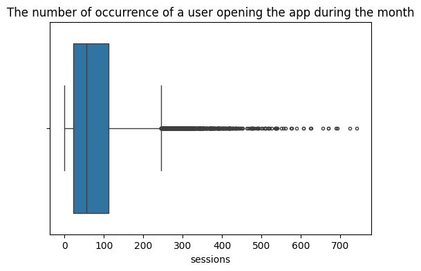
    


```python
# Histogram
### YOUR CODE HERE ###
plt.figure(figsize=(6,4))
sns.histplot(df['sessions'], bins=range(0,1000,50))
plt.title('The number of occurrence of a user opening the app during the month');
```


    
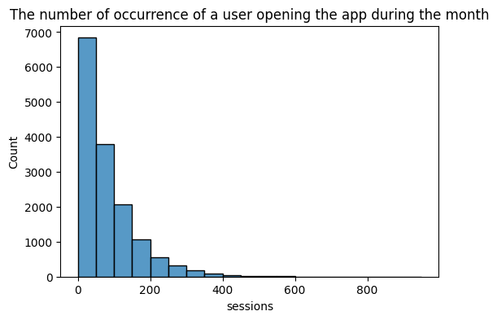
    


### Drives


```python
# Box plot
### YOUR CODE HERE ###
plt.figure(figsize=(6,4))
plt.title('An occurrence of driving at least 1 km during the month')
sns.boxplot(data=None, x=df['drives'], fliersize=3);
```


    
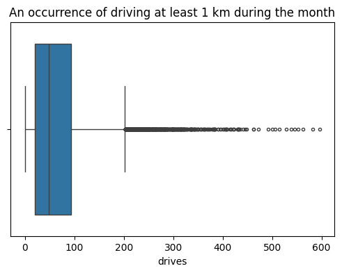
    


```python
# Histogram
### YOUR CODE HERE ###
plt.figure(figsize=(6,4))
sns.histplot(df['drives'], bins=range(0,1000,50))
plt.title('An occurrence of driving at least 1 km during the month');
```


    
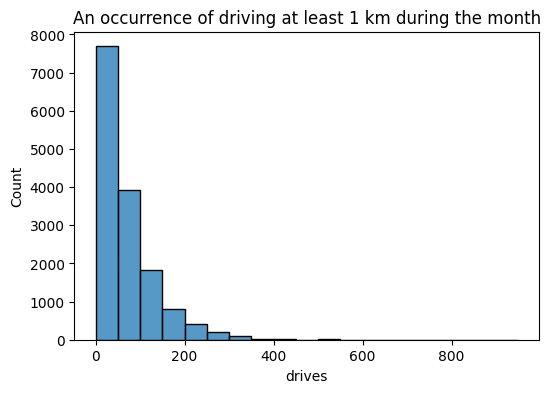
    


### Total Seassons


```python
# Box plot
### YOUR CODE HERE ###
plt.figure(figsize=(6,4))
plt.title('Total number of sessions since a user has onboarded')
sns.boxplot(data=None, x=df['total_sessions'], fliersize=3);
```


    

    


```python
def histogrammer(column_str, median_text=True, **kwargs):    # **kwargs = any keyword arguments
                                                             # from the sns.histplot() function
    median=round(df[column_str].median(), 1)
    plt.figure(figsize=(5,3))
    ax = sns.histplot(x=df[column_str], **kwargs)            # Plot the histogram
    plt.axvline(median, color='red', linestyle='--')         # Plot the median line
    if median_text==True:                                    # Add median text unless set to False
        ax.text(0.25, 0.85, f'median={median}', color='red',
            ha='left', va='top', transform=ax.transAxes)
    else:
        print('Median:', median)
    plt.title(f'{column_str} histogram');
# Histogram
histogrammer('drives')
```


    
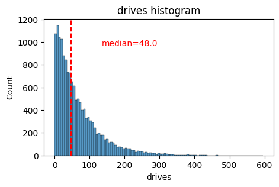
    


#### The number of days since a user signed up for the app.


```python
# Box plot
plt.figure(figsize=(5,1))
sns.boxplot(x=df['n_days_after_onboarding'], fliersize=1)
plt.title('n_days_after_onboarding box plot');
```


    

    


```python
histogrammer('n_days_after_onboarding', median_text=False)
```

    Median: 1741.0


    

    


#### Uniform distribution

### Total km driven during the month


```python
# Box plot
plt.figure(figsize=(5,1))
sns.boxplot(x=df['driven_km_drives'], fliersize=1)
plt.title('driven_km_drives box plot');
```


    

    


```python
# Histogram
histogrammer('driven_km_drives')
```


    

    


### Total duration driven in minutes during the month 


```python
# Box plot
plt.figure(figsize=(5,1))
sns.boxplot(x=df['duration_minutes_drives'], fliersize=1)
plt.title('duration_minutes_drives box plot');
```


    
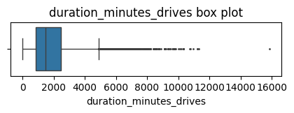
    


```python
# Histogram
histogrammer('duration_minutes_drives')
```


    

    


### Activity Days


```python
# Box plot
plt.figure(figsize=(5,1))
sns.boxplot(x=df['activity_days'], fliersize=1)
plt.title('Number of days the user opens the app during the month');
```


    

    


```python
# Histogram
histogrammer('activity_days', median_text=False, discrete=True)
plt.title('Number of days the user opens the app during the month');
```

    Median: 16.0


    
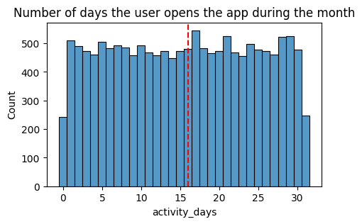
    


### Driving Days


```python
# Box plot
### YOUR CODE HERE ###
plt.figure(figsize=(5,1))
sns.boxplot(x=df['activity_days'], fliersize=1)
plt.title('Number of days the user drives (at least 1 km) during the month');
```


    

    


```python
histogrammer('driving_days', median_text=False, discrete=True)
```

    Median: 12.0


    
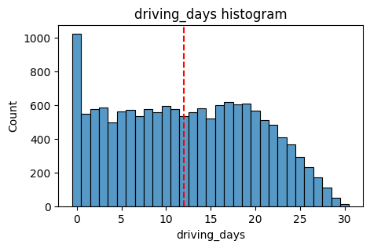
    


#### The type of device a user starts a session with


```python
# Pie chart
fig = plt.figure(figsize=(3,3))
data=df['device'].value_counts()
plt.pie(data,
        labels=[f'{data.index[0]}: {data.values[0]}',
                f'{data.index[1]}: {data.values[1]}'],
        autopct='%1.1f%%'
        )
plt.title('Users by device');
```


    
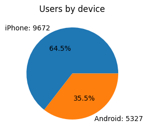
    


```python
# Pie chart
fig = plt.figure(figsize=(3,3))
data=df['label'].value_counts()
plt.pie(data,
        labels=[f'{data.index[0]}: {data.values[0]}',
                f'{data.index[1]}: {data.values[1]}'],
        autopct='%1.1f%%'
        )
plt.title('Count of retained vs. churned');
```


    

    


driving_days vs. activity_days
Because both driving_days and activity_days represent counts of days over a month and they're also closely related, you can plot them together on a single histogram. This will help to better understand how they relate to each other without having to scroll back and forth comparing histograms in two different places.


```python
# Histogram
plt.figure(figsize=(12,4))
label=['driving days', 'activity days']
plt.hist([df['driving_days'], df['activity_days']],
         bins=range(0,33),
         label=label)
plt.xlabel('days')
plt.ylabel('count')
plt.legend()
plt.title('driving_days vs. activity_days');
```


    

    


```python
# Scatter plot
sns.scatterplot(data=df, x='driving_days', y='activity_days')
plt.title('driving_days vs. activity_days')
plt.plot([0,31], [0,31], color='red', linestyle='--');
```


    
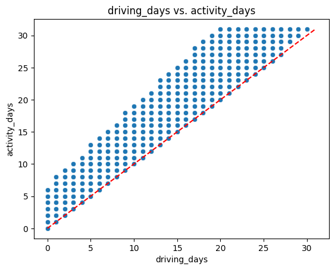
    


### Retention by device


```python
# Histogram
plt.figure(figsize=(5,4))
sns.histplot(data=df,
             x='device',
             hue='label',
             multiple='dodge',
             shrink=0.9
             )
plt.title('Retention by device histogram');
```


    
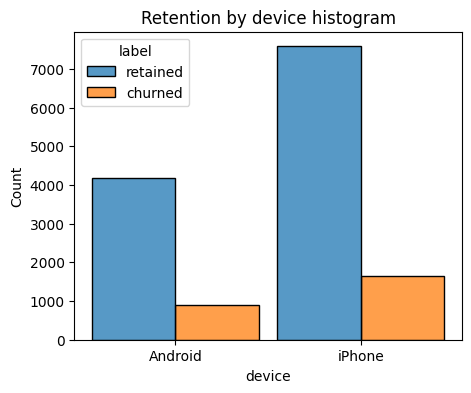
    


### Retention by kilometers driven per driving day


```python
# 1. Create `km_per_driving_day` column
df['km_per_driving_day'] = df['driven_km_drives'] / df['driving_days']

# 2. Call `describe()` on the new column
df['km_per_driving_day'].describe()
```

    /Users/angelabello/Library/Python/3.9/lib/python/site-packages/pandas/core/nanops.py:1016: RuntimeWarning: invalid value encountered in subtract
      sqr = _ensure_numeric((avg - values) ** 2)


    count    1.499900e+04
    mean              inf
    std               NaN
    min      3.022063e+00
    25%      1.672804e+02
    50%      3.231459e+02
    75%      7.579257e+02
    max               inf
    Name: km_per_driving_day, dtype: float64


The standar deviation is NaN, and the max value is infinity. This is the result of there being values of zero in the driving_days column. To solve we can convert these values to zero (np.inf to refer to a value of infinity) 


```python
# 1. Convert infinite values to zero
df.loc[df['km_per_driving_day']==np.inf, 'km_per_driving_day'] = 0

# 2. Confirm that it worked
df['km_per_driving_day'].describe()
```


    count    14999.000000
    mean       578.963113
    std       1030.094384
    min          0.000000
    25%        136.238895
    50%        272.889272
    75%        558.686918
    max      15420.234110
    Name: km_per_driving_day, dtype: float64


The maximum value is 15,420 kilometers per drive day. This is physically impossible. Driving 100 km/hour for 12 hours is 1,200 km. It's unlikely many people averaged more than this each day they drove, so, for now, disregard rows where the distance in this column is greater than 1,200 km.

Plot a histogram of the new km_per_driving_day column, disregarding those users with values greater than 1,200 km. Each bar should be the same length and have two colors, one color representing the percent of the users in that bar that churned and the other representing the percent that were retained. This can be done by setting the multiple parameter of seaborn's histplot() function to fill.


```python
# Histogram
plt.figure(figsize=(12,5))
sns.histplot(data=df,
             x='km_per_driving_day',
             bins=range(0,1201,20),
             hue='label',
             multiple='fill')
plt.ylabel('%', rotation=0)
plt.title('Churn rate by mean km per driving day');
```


    

    


### Churn rate per number of driving days


```python
# Histogram
plt.figure(figsize=(12,5))
sns.histplot(data=df,
             x='driving_days',
             bins=range(1,32),
             hue='label',
             multiple='fill',
             discrete=True)
plt.ylabel('%', rotation=0)
plt.title('Churn rate per driving day');
```


    

    


#### Proportion of sessions that occurred in the last month


```python
df['percent_sessions_in_last_month'] = df['sessions'] / df['total_sessions']
```


```python
df['percent_sessions_in_last_month'].median()
```


    np.float64(0.42309702992763176)


```python
histogrammer('percent_sessions_in_last_month',
             hue=df['label'],
             multiple='layer',
             median_text=False)
```

    Median: 0.4


    

    


```python
df['n_days_after_onboarding'].median()
```


    np.float64(1741.0)


```python
# Histogram
data = df.loc[df['percent_sessions_in_last_month']>=0.4]
plt.figure(figsize=(5,3))
sns.histplot(x=data['n_days_after_onboarding'])
plt.title('Num. days after onboarding for users with >=40% sessions in last month');
```


    

    


### Handling outliers

The box plots from the previous section indicated that many of these variables have outliers. These outliers do not seem to be data entry errors; they are present because of the right-skewed distributions.

Depending on what you'll be doing with this data, it may be useful to impute outlying data with more reasonable values. One way of performing this imputation is to set a threshold based on a percentile of the distribution.

To practice this technique, write a function that calculates the 95th percentile of a given column, then imputes values > the 95th percentile with the value at the 95th percentile. such as the 95th percentile of the distribution.


```python
def outlier_imputer(column_name, percentile):
    # Calculate threshold
    threshold = df[column_name].quantile(percentile)
    # Impute threshold for values > than threshold
    df.loc[df[column_name] > threshold, column_name] = threshold

    print('{:>25} | percentile: {} | threshold: {}'.format(column_name, percentile, threshold))
```


```python
for column in ['sessions', 'drives', 'total_sessions',
               'driven_km_drives', 'duration_minutes_drives']:
               outlier_imputer(column, 0.95)
```

                     sessions | percentile: 0.95 | threshold: 243.0
                       drives | percentile: 0.95 | threshold: 201.0
               total_sessions | percentile: 0.95 | threshold: 454.3632037399997
             driven_km_drives | percentile: 0.95 | threshold: 8889.7942356
      duration_minutes_drives | percentile: 0.95 | threshold: 4668.899348999998


```python
df.describe()
```


<div>
<style scoped>
    .dataframe tbody tr th:only-of-type {
        vertical-align: middle;
    }

    .dataframe tbody tr th {
        vertical-align: top;
    }

    .dataframe thead th {
        text-align: right;
    }
</style>
<table border="1" class="dataframe">
  <thead>
    <tr style="text-align: right;">
      <th></th>
      <th>ID</th>
      <th>sessions</th>
      <th>drives</th>
      <th>total_sessions</th>
      <th>n_days_after_onboarding</th>
      <th>total_navigations_fav1</th>
      <th>total_navigations_fav2</th>
      <th>driven_km_drives</th>
      <th>duration_minutes_drives</th>
      <th>activity_days</th>
      <th>driving_days</th>
      <th>km_per_driving_day</th>
      <th>percent_sessions_in_last_month</th>
    </tr>
  </thead>
  <tbody>
    <tr>
      <th>count</th>
      <td>14999.000000</td>
      <td>14999.000000</td>
      <td>14999.000000</td>
      <td>14999.000000</td>
      <td>14999.000000</td>
      <td>14999.000000</td>
      <td>14999.000000</td>
      <td>14999.000000</td>
      <td>14999.000000</td>
      <td>14999.000000</td>
      <td>14999.000000</td>
      <td>14999.000000</td>
      <td>14999.000000</td>
    </tr>
    <tr>
      <th>mean</th>
      <td>7499.000000</td>
      <td>76.568705</td>
      <td>64.058204</td>
      <td>184.031320</td>
      <td>1749.837789</td>
      <td>121.605974</td>
      <td>29.672512</td>
      <td>3939.632764</td>
      <td>1789.647426</td>
      <td>15.537102</td>
      <td>12.179879</td>
      <td>578.963113</td>
      <td>0.449255</td>
    </tr>
    <tr>
      <th>std</th>
      <td>4329.982679</td>
      <td>67.297958</td>
      <td>55.306924</td>
      <td>118.600463</td>
      <td>1008.513876</td>
      <td>148.121544</td>
      <td>45.394651</td>
      <td>2216.041510</td>
      <td>1222.705167</td>
      <td>9.004655</td>
      <td>7.824036</td>
      <td>1030.094384</td>
      <td>0.286919</td>
    </tr>
    <tr>
      <th>min</th>
      <td>0.000000</td>
      <td>0.000000</td>
      <td>0.000000</td>
      <td>0.220211</td>
      <td>4.000000</td>
      <td>0.000000</td>
      <td>0.000000</td>
      <td>60.441250</td>
      <td>18.282082</td>
      <td>0.000000</td>
      <td>0.000000</td>
      <td>0.000000</td>
      <td>0.000000</td>
    </tr>
    <tr>
      <th>25%</th>
      <td>3749.500000</td>
      <td>23.000000</td>
      <td>20.000000</td>
      <td>90.661156</td>
      <td>878.000000</td>
      <td>9.000000</td>
      <td>0.000000</td>
      <td>2212.600607</td>
      <td>835.996260</td>
      <td>8.000000</td>
      <td>5.000000</td>
      <td>136.238895</td>
      <td>0.196221</td>
    </tr>
    <tr>
      <th>50%</th>
      <td>7499.000000</td>
      <td>56.000000</td>
      <td>48.000000</td>
      <td>159.568115</td>
      <td>1741.000000</td>
      <td>71.000000</td>
      <td>9.000000</td>
      <td>3493.858085</td>
      <td>1478.249859</td>
      <td>16.000000</td>
      <td>12.000000</td>
      <td>272.889272</td>
      <td>0.423097</td>
    </tr>
    <tr>
      <th>75%</th>
      <td>11248.500000</td>
      <td>112.000000</td>
      <td>93.000000</td>
      <td>254.192341</td>
      <td>2623.500000</td>
      <td>178.000000</td>
      <td>43.000000</td>
      <td>5289.861262</td>
      <td>2464.362632</td>
      <td>23.000000</td>
      <td>19.000000</td>
      <td>558.686918</td>
      <td>0.687216</td>
    </tr>
    <tr>
      <th>max</th>
      <td>14998.000000</td>
      <td>243.000000</td>
      <td>201.000000</td>
      <td>454.363204</td>
      <td>3500.000000</td>
      <td>1236.000000</td>
      <td>415.000000</td>
      <td>8889.794236</td>
      <td>4668.899349</td>
      <td>31.000000</td>
      <td>30.000000</td>
      <td>15420.234110</td>
      <td>1.530637</td>
    </tr>
  </tbody>
</table>
</div>


### Conclusion
Analysis revealed that the overall churn rate is ~17%, and that this rate is consistent between iPhone users and Android users.

Perhaps you feel that the more deeply you explore the data, the more questions arise. This is not uncommon! In this case, it's worth asking the Waze data team why so many users used the app so much in just the last month.

Also, EDA has revealed that users who drive very long distances on their driving days are more likely to churn, but users who drive more often are less likely to churn. The reason for this discrepancy is an opportunity for further investigation, and it would be something else to ask the Waze data team about.


```python

```
